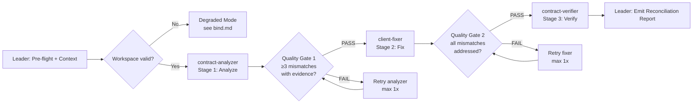

# Workflow: 3-Stage API Contract Reconciliation Pipeline

## Overview



## Pattern Note

This is a **Pattern C (Specialization Pipeline)** Swarm Skill. Three sequential stages with enforced quality gates between them: Analyze → Fix → Verify. Each stage's output is the next stage's required input. Stages cannot be skipped and stages must not overlap.

## Detailed Steps

### Step 0 — Pre-flight: workspace validation

- **Executor**: Leader
- **Input**: User-provided workspace path containing `service/`, `client/`, `api_spec.yaml`, `tests/`
- **Action**: Verify the workspace contains the required directory structure (Go server source, Python client source, spec, tests). Report missing components.
- **Output**: Pre-flight report — either "workspace valid" or a list of missing components
- **Quality gate**: User confirms the workspace path is correct. If critical components are missing (e.g., no `service/` directory), the pipeline halts and asks the user to fix.

### Step 1 — Analyze: contract-analyzer reads server, client, spec

- **Executor**: contract-analyzer
- **Input**: Go server source files (`service/handlers.go`, `service/models.go`), Python client source files (`client/api.py`, `client/models.py`, `client/exceptions.py`), API spec (`api_spec.yaml`)
- **Action**: The analyzer performs a 3-way cross-read: server ↔ client, server ↔ spec, client ↔ spec. The server's actual JSON output (struct tags, response construction, status codes) is the source of truth. Every divergence in field names, response shapes, and error formats is documented with file:line evidence and a fix prescription.
- **Output**: Structured mismatch report per `roles/contract-analyzer.md` Output Schema
- **Serial / Parallel**: Serial (Stage 1 of 3)
- **Quality gate**: 
  - **Pass criteria**: Report contains ≥3 mismatches, each with server-side file:line evidence and a concrete fix prescription. Coverage summary lists endpoints analyzed.
  - **Fail**: Report has <3 mismatches, or mismatches lack file:line evidence, or the server is not treated as source of truth. 
  - **Fail action**: Re-dispatch the analyzer with explicit instruction to re-check every server struct tag against the client's field access patterns. Max 1 retry. On 2nd failure, surface the partial analysis to the user and ask whether to proceed with what was found.

### Step 2 — Fix: client-fixer applies prescribed changes

- **Executor**: client-fixer
- **Input**: Contract Analyzer's mismatch report + Python client files + `api_spec.yaml`
- **Action**: For each mismatch in the analyzer's report, the fixer locates the exact file:line, applies the prescribed change, and records the diff. The fixer also updates `api_spec.yaml` to document the server's actual contract. Go source files are NEVER touched.
- **Output**: Structured fix report per `roles/client-fixer.md` Output Schema, with before/after snippets for every change
- **Serial / Parallel**: Serial (Stage 2 of 3, depends on Stage 1)
- **Quality gate**:
  - **Pass criteria**: Every mismatch from the analyzer's report has a corresponding fix entry. All affected files are listed in "Files Modified". No `.go` files appear in the modified list. All Python syntax remains valid.
  - **Fail**: Any mismatch is unaddressed without explanation, or a `.go` file is listed as modified, or the fix report lacks before/after snippets.
  - **Fail action**: Re-dispatch the fixer with the unaddressed mismatches explicitly listed. Max 1 retry. On 2nd failure, surface the partial fix to the user.

### Step 3 — Verify: contract-verifier validates fixes

- **Executor**: contract-verifier
- **Input**: Analyzer's mismatch report + Fixer's fix report + workspace path
- **Action**: The verifier runs `pytest tests/` from the workspace root, checks `go build ./...` from the service directory, and cross-checks every analyzer mismatch against the fixer's "After" snippets to confirm resolution.
- **Output**: Structured verification report per `roles/contract-verifier.md` Output Schema, with PASS/FAIL verdict and evidence
- **Serial / Parallel**: Serial (Stage 3 of 3, depends on Stage 2)
- **Quality gate**: (terminal stage — verification IS the final gate)
  - **Pass**: All tests pass, server compiles, all mismatches confirmed resolved.
  - **Fail (on test failure)**: Report the specific test failures. Leader surfaces them in the final report; user decides whether to accept partial fixes.
  - **Fail (on compilation failure)**: Go server was likely modified — this is a contract violation. Report and halt.

### Step 4 — Final: emit Reconciliation Report

- **Executor**: Leader
- **Input**: Outputs from all 3 stages (analyzer report, fixer report, verifier report)
- **Action**: Compose the final reconciliation report. The Leader does NOT re-analyze, re-fix, or re-verify — it only integrates and formats.
- **Output**: Reconciliation Report in the format below

#### Final Report Format

```markdown
# API Contract Reconciliation Report

## Summary
<N> contract mismatches found, <M> fixed, <K> verified.

## Mismatches Found (Stage 1: Analyzer)
| ID | Category | Server (truth) | Client (broken) | Spec (broken) |
|---|---|---|---|---|
| M1 | Field Naming | `userId` (models.go:L4) | `user_id` (models.py:L14) | `user_id` (api_spec.yaml:L60) |
| M2 | Response Shape | `data`/`next` (handlers.go:L20-22) | `results`/`cursor` (api.py:L21,L23) | `results`/`cursor` (api_spec.yaml:L26,L30) |
| M3 | Error Format | HTTP 422 + `errors[]` (handlers.go:L32-36) | HTTP 400 + `error` str (exceptions.py:L9-11) | HTTP 400 + `error` str (api_spec.yaml:L45-52) |

## Fixes Applied (Stage 2: Fixer)
- **models.py**: `user_id` → `userId` field remapping
- **api.py**: `results`→`data`, `cursor`→`next` pagination keys
- **exceptions.py**: HTTP 400→422, `error`→`errors[]` error handling
- **api_spec.yaml**: Updated all 3 mismatched sections to match server

## Verification (Stage 3: Verifier)
- **pytest tests/**: <PASS / FAIL with details>
- **go build ./...**: <PASS / FAIL>
- **Mismatch audit**: <all resolved / gaps listed>

## Files Modified
- `client/models.py`
- `client/api.py`
- `client/exceptions.py`
- `api_spec.yaml`

## Verdict
- <PASS: all mismatches resolved and verified / FAIL: <specific failures>>
```

## Acceptance Criteria

- All 3 pipeline stages completed and returned outputs matching their `## Output Schema`.
- Analyzer identified ≥3 mismatches with server-side file:line evidence.
- Fixer addressed every mismatch (no unfixed items without explanation) and did not touch `.go` files.
- Verifier ran `pytest tests/` and `go build ./...`, and audited every mismatch.
- Final Reconciliation Report contains all sections: Summary, Mismatches Found, Fixes Applied, Verification, Files Modified, Verdict.
- Leader never performed analysis, fixing, or verification — only integration and formatting.
