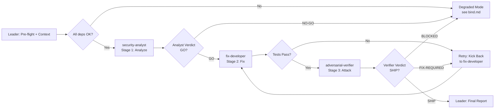

# Workflow: JWT Security Bugfix Pipeline with Adversarial Gate

## Overview



## Detailed Steps

### Step 0 — Pre-flight: dependency check

- **Executor**: Leader
- **Input**: [dependencies.yaml](dependencies.yaml)
- **Action**: verify `python3` and `pytest` are available in the execution environment. Read the task spec from {TASK_SPEC_PATH} and verify the codebase at {CODEBASE_PATH} is accessible.
- **Output**: pre-flight report to user listing available/missing dependencies
- **Quality gate**: user decides go/no-go on missing items. If `pytest` is missing, warn that tests cannot be run — suggest degraded mode.

### Step 1 — Stage 1: Security Analysis

- **Executor**: security-analyst
- **Input**: task spec ({TASK_SPEC}), source code at {CODEBASE_PATH} (auth.py, refresh.py, middleware.py, config.py, tests/test_auth.py)
- **Action**: Read all source files. Confirm each of the 6 listed bugs exists in the code. Identify any additional security concerns beyond the spec. Produce a severity-ordered fix checklist.
- **Output**: Analyst Report matching [roles/security-analyst.md](roles/security-analyst.md) Output Schema
- **Serial / Parallel**: Serial (must complete before developer starts)
- **Quality gate**: Analyst Verdict must be GO (all bugs confirmed, checklist is actionable). If NO-GO (spec bugs not reproducible, code missing, or blockers found), halt and escalate to user with the analyst's full report. Max 1 retry on malformed output.

### Step 2 — Stage 2: Fix Implementation

- **Executor**: fix-developer
- **Input**: Security Analyst's fix checklist ({ANALYST_CHECKLIST}), source code at {CODEBASE_PATH}, test suite at {CODEBASE_PATH}/tests/
- **Action**: Apply each fix from the checklist in severity order. Run `pytest` after each fix. Produce FIXES_APPLIED.md with before/after snippets.
- **Output**: Fixed source files + FIXES_APPLIED.md matching [roles/fix-developer.md](roles/fix-developer.md) Output Schema
- **Serial / Parallel**: Serial (depends on analyst output)
- **Quality gate**: All existing tests must pass (exit code 0, zero failures). If tests fail, kick back to fix-developer (max 2 retries). On 3rd failure, escalate to user with the failing test output and the developer's FIXES_APPLIED.md.

### Step 3 — Stage 3: Adversarial Verification

- **Executor**: adversarial-verifier
- **Input**: original task spec ({TASK_SPEC}), fix-developer's FIXES_APPLIED.md ({FIXES_APPLIED}), fixed source code at {CODEBASE_PATH}, test suite
- **Action**: For each of the 6 bugs, design and execute at least 1 concrete attack. Attempt at least 2 additional edge-case attacks. Run `pytest` independently. Report PASS/FAIL per attack.
- **Output**: Verification Report matching [roles/adversarial-verifier.md](roles/adversarial-verifier.md) Output Schema
- **Serial / Parallel**: Serial (depends on developer output)
- **Quality gate**: Verifier Verdict must be SHIP (all attacks defeated, test suite green). If FIX-REQUIRED (any bug FAILs), kick back to fix-developer with the specific failing attacks and reproduction steps. If BLOCKED (environment issue), escalate. Max 2 kick-back cycles total (analyst → developer → verifier → developer → verifier).

### Step 4 — Final: emit JWT Security Fix Report

- **Executor**: Leader
- **Input**: outputs from all three stages (Analyst Report, FIXES_APPLIED.md, Verification Report)
- **Action**: Compose the final report. Surface all three stages verbatim. If the adversarial verifier found failures that were addressed in a kick-back cycle, note the resolution. Do NOT mediate contradictions between stages — surface them for human review.
- **Output**: JWT Security Fix Report in the format below

#### Final Report Format

```markdown
# JWT Security Fix Report

## Summary
<1-3 sentence overview: what was fixed, verification result, ship/no-ship recommendation>

## Stage 1: Security Analysis
<Analyst Report verbatim>

## Stage 2: Fix Implementation
<FIXES_APPLIED.md verbatim>

## Stage 3: Adversarial Verification
<Verification Report verbatim>

## Contradictions (surfaced verbatim, NOT mediated)
- <if analyst and verifier disagree on any finding, surface here>

## Final Recommendation
- SHIP / NO-SHIP with rationale
```

## Acceptance Criteria

- All three roles returned outputs matching their respective `## Output Schema` (no malformed responses).
- Final Report contains all four sections (Analysis, Fixes, Verification, Recommendation) with verbatim role outputs.
- All C-pattern quality gates passed or explicit kick-back cycles recorded with resolution.
- Adversarial Verifier produced at least 6 attack results (one per bug) plus at least 2 extended attacks.
- Final test suite run reproduced twice (once by developer, once by verifier) with identical pass/fail counts.
- Contradictions between stages (if any) surfaced verbatim in the Final Report, never mediated by Leader.
