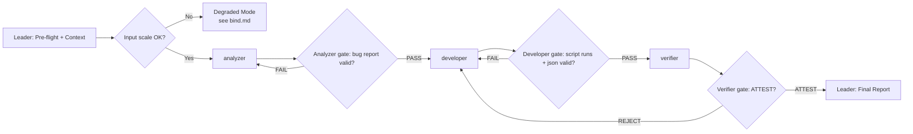

# Workflow: Analyze → Fix → Verify reconciliation pipeline

## Overview



- **Pattern**: C — Specialization Pipeline (3 sequential stages with quality gates).
- **Retry loops**: Analyzer re-dispatched on malformed output; Developer re-dispatched on script failure or invalid JSON; pipeline kicks back from Verifier to Developer on REJECT verdict.

## Detailed Steps

### Step 0 — Pre-flight: dependency check

- **Executor**: Leader
- **Input**: [dependencies.yaml](dependencies.yaml)
- **Action**: verify each `skills[]` and `tools[]` entry is available. Report missing `required: true` items as blockers; missing `required: false` as warnings.
- **Output**: pre-flight report to user
- **Quality gate**: user decides go/no-go on missing items. Agent does NOT auto-decide.

### Step 1 — Requirements Analysis

- **Executor**: `analyzer`
- **Input**: Full specification from TASK.md (all 6 reconciliation rules + field ownership designations + output format requirements), the current `reconcile.py` code, and the data files (`system_a.json`, `system_b.json`) as context
- **Action**: Trace every rule to its code path, produce a severity-ranked bug report, verify output field coverage for all reconciliation scenarios
- **Output**: Structured bug report matching the `## Output Schema` in [roles/analyzer.md](roles/analyzer.md)
- **Serial / Parallel**: Serial — must complete before Developer starts
- **Quality gate**: 
  - **Pass criteria**: Bug report contains a Rule Traceability Matrix covering all 6 rules with verdicts, a severity-ranked bug list with at least 1 BLOCKER or MAJOR finding, and an Output Field Coverage table covering all 4 scenarios.
  - **Fail action**: Re-dispatch analyzer with explicit instruction to address missing sections. Max 1 retry. On 2nd malformed output, proceed with partial report tagged `[ANALYZER PARTIAL]`.

### Step 2 — Code Fix and Execution

- **Executor**: `developer`
- **Input**: The Analyzer's bug report (full output from Step 1), the current `reconcile.py`, and the workspace directory path
- **Action**: Fix all bugs from the Analyzer's Priority Action List in priority order, run `python reconcile.py`, verify `reconciled.json` is produced and is valid JSON
- **Output**: Fixed `reconcile.py` in workspace, `reconciled.json` in workspace, and a fix report matching the `## Output Schema` in [roles/developer.md](roles/developer.md)
- **Serial / Parallel**: Serial — must complete before Verifier starts
- **Quality gate**: 
  - **Pass criteria**: `python reconcile.py` exits 0, `reconciled.json` exists and parses as valid JSON, fix report accounts for all bugs in the Analyzer's Priority Action List.
  - **Fail action**: Re-dispatch developer with the specific failure reason. Max 1 retry. On 2nd failure, mark as `[DEVELOPER FAILED]` and surface partial output.

### Step 3 — Compliance Verification

- **Executor**: `verifier`
- **Input**: The full specification, `reconciled.json`, `system_a.json`, `system_b.json`
- **Action**: Independently verify all 6 reconciliation rules against `reconciled.json` records. Walk through edge-case records field by field. Produce ATTEST or REJECT verdict. **Do NOT read the Developer's fix report until after independent verification is complete.**
- **Output**: Verification report matching the `## Output Schema` in [roles/verifier.md](roles/verifier.md)
- **Serial / Parallel**: Serial — final stage before integration
- **Quality gate**: 
  - **Pass criteria**: Verdict is ATTEST — all 6 rules independently verified with record-level evidence. Edge-case walkthrough covers at least 2 subscriber IDs. Output structure check confirms all 12 fields, sort order, null correctness, and enum validity.
  - **Fail action (REJECT)**: Pipeline kicks back to Step 2 (Developer) with the Verifier's Violation Details table. The Developer fixes the specific violations and re-runs. Max 2 kick-back cycles. On 3rd REJECT, surface both reports to user and ask for direction.

### Step 4 — Final: emit Reconciliation Report

- **Executor**: Leader
- **Input**: Outputs from all 3 stages — Analyzer bug report, Developer fix report, Verifier attestation report
- **Action**: Compose the final report. If ATTEST: confirm all rules pass. If REJECT after max retries: surface unresolved violations verbatim with the specific records and fields that fail.
- **Output**: Reconciliation Report in the format below

#### Final Report Format

```markdown
# Data Reconciliation Report

## Summary
<1-3 sentence overview: verification result, record count, key findings>

## Verification Result
- **Verdict**: ATTEST / REJECT
- **Records reconciled**: <N>
- **Rules verified**: 6/6

## Rule Verification Summary
| Rule | Description | Verdict |
|---|---|---|
| 1 | Manual Override | PASS / FAIL |
| 2 | Field Ownership | PASS / FAIL |
| 3 | Shared Field Conflict Resolution | PASS / FAIL |
| 4 | System A Only Records | PASS / FAIL |
| 5 | System B Only Records | PASS / FAIL |
| 6 | Both Systems — No Conflict Merge | PASS / FAIL |

## Unresolved Violations (if REJECT)
| Subscriber ID | Rule | Field | Expected | Actual |
|---|---|---|---|---|
| ... | ... | ... | ... | ... |

## Bug Fix Summary
<Brief summary of what was fixed from the Analyzer's report>

## Coverage Map
- Analyzer: <N bugs identified, covering rules 1-6>
- Developer: <N bugs fixed, N unfixed>
- Verifier: <N edge cases tested, verdict ATTEST/REJECT>
```

## Acceptance Criteria

- Analyzer produced a bug report covering all 6 reconciliation rules with at least 1 BLOCKER or MAJOR finding.
- Developer produced fixed `reconcile.py` that executes without error and generates valid `reconciled.json`.
- Verifier independently confirmed all 6 rules pass with record-level evidence, or produced a concrete REJECT report with specific violations.
- Final report contains a binary ATTEST/REJECT verdict with supporting evidence.
- All pipeline gates passed or explicit kick-back/failure recorded.
- No role rewrote upstream output — each stage built on the prior stage's deliverable.
