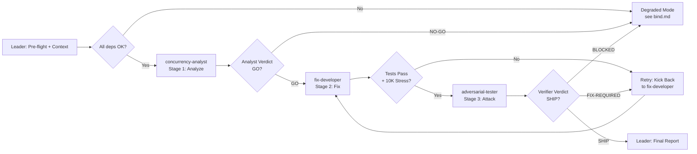

# Workflow: Message Queue Race Condition Fix Pipeline with Adversarial Gate

## Overview



## Detailed Steps

### Step 0 — Pre-flight: dependency check

- **Executor**: Leader
- **Input**: [dependencies.yaml](dependencies.yaml)
- **Action**: verify `python3` and `pytest` are available. Read the task spec from {TASK_SPEC_PATH} and verify the codebase at {CODEBASE_PATH} is accessible.
- **Output**: pre-flight report listing available/missing dependencies
- **Quality gate**: user decides go/no-go on missing items. If `pytest` missing, warn — tests cannot run, degraded mode.

### Step 1 — Stage 1: Concurrency Analysis

- **Executor**: concurrency-analyst
- **Input**: task spec ({TASK_SPEC}), source code at {CODEBASE_PATH}, test suite
- **Action**: Read all source and test files. Confirm each of the 3 race conditions exists. Map each to a concrete interleaving timeline. Design the ack/nack pattern contract. Identify additional concurrency concerns.
- **Output**: Analyst Report matching [roles/concurrency-analyst.md](roles/concurrency-analyst.md) Output Schema
- **Serial / Parallel**: Serial
- **Quality gate**: Analyst Verdict must be GO (all bugs confirmed, checklist and ack/nack design are actionable). Max 1 retry on malformed output.

### Step 2 — Stage 2: Fix Implementation

- **Executor**: fix-developer
- **Input**: Analyst's fix checklist ({ANALYST_CHECKLIST}), ack/nack pattern design, source code, test suite
- **Action**: Apply each fix in dependency order. Run full `pytest` after each fix. Verify `test_zero_message_loss_10k` passes. Produce FIXES_APPLIED.md.
- **Output**: Fixed source files + FIXES_APPLIED.md matching [roles/fix-developer.md](roles/fix-developer.md) Output Schema
- **Serial / Parallel**: Serial
- **Quality gate**: All tests pass (exit 0, zero failures) AND 10K stress test passes (zero message loss). Max 2 retries; escalate on 3rd failure.

### Step 3 — Stage 3: Adversarial Stress Testing

- **Executor**: adversarial-tester
- **Input**: task spec ({TASK_SPEC}), FIXES_APPLIED.md ({FIXES_APPLIED}), fixed source code, test suite
- **Action**: Design and execute at least 1 concurrent stress test per bug. Attempt at least 2 extended edge-case attacks. Simulate consumer crashes mid-processing. Run full `pytest` and 10K stress test independently.
- **Output**: Verification Report matching [roles/adversarial-tester.md](roles/adversarial-tester.md) Output Schema
- **Serial / Parallel**: Serial
- **Quality gate**: Verdict must be SHIP (all attacks defeated, tests green, 10K stress passes). If FIX-REQUIRED, kick back to developer. Max 2 full kick-back cycles.

### Step 4 — Final: emit Queue Race Fix Report

- **Executor**: Leader
- **Input**: outputs from all three stages
- **Action**: Compose the final report. Surface all stages verbatim. Never mediate contradictions.
- **Output**: Queue Race Fix Report

#### Final Report Format

```markdown
# Message Queue Race Condition Fix Report

## Summary
<1-3 sentence overview: what was fixed, verification result, ship/no-ship>

## Stage 1: Concurrency Analysis
<Analyst Report verbatim>

## Stage 2: Fix Implementation
<FIXES_APPLIED.md verbatim>

## Stage 3: Adversarial Stress Testing
<Verification Report verbatim>

## Contradictions
- <surfaced verbatim, never mediated>

## Final Recommendation
- SHIP / NO-SHIP with rationale
```

## Acceptance Criteria

- All three roles returned outputs matching their Output Schema.
- Final Report contains all four sections with verbatim role outputs.
- All quality gates passed or kick-back cycles recorded with resolution.
- Adversarial Tester produced at least 3 attack results (one per bug) plus at least 2 extended attacks.
- 10K stress test (20 threads, zero loss) passed twice (developer + tester) with identical results.
- Test suite passed twice (developer + tester) with identical pass/fail counts.
- Contradictions surfaced verbatim, never mediated.
