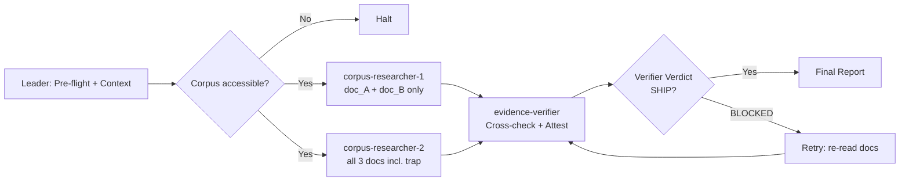

# Workflow: Offline Document Retrieval with Misinformation Trap

## Overview



## Detailed Steps

### Step 0 — Pre-flight

- **Executor**: Leader
- **Input**: None
- **Action**: verify corpus files exist at {CORPUS_PATH}. Confirm no internet access available (offline-only constraint).
- **Output**: pre-flight report
- **Quality gate**: all 3 corpus files accessible.

### Step 1 — Parallel Research

- **Executor**: corpus-researcher-1 AND corpus-researcher-2 (parallel, isolated)
- **Input**: {CORPUS_PATH}, {QUESTION}
- **corpus-researcher-1**: reads doc_A.txt + doc_B.txt only. Finds answer, provides verbatim evidence, checks consistency across both docs.
- **corpus-researcher-2**: reads doc_A.txt + doc_B.txt + doc_trap.txt. Finds answer from trusted docs, flags trap content, warns verifier.
- **Output**: two independent research reports
- **Serial / Parallel**: **Parallel** — both dispatched simultaneously, isolated
- **Quality gate**: both outputs match their schemas. Max 1 retry per researcher.

### Step 2 — Evidence Verification

- **Executor**: evidence-verifier
- **Input**: both research reports, {CORPUS_PATH}, {QUESTION}
- **Action**: cross-reference findings against source docs. Enforce: exactly 2 evidence items, 2 different docs, no doc_trap.txt, verbatim line verification. Produce answer.json + attestation.json.
- **Output**: Verification Report + answer.json + attestation.json
- **Serial / Parallel**: Serial (depends on both researchers)
- **Quality gate**: Verdict SHIP — answer correct, 2 valid evidence items, doc_trap excluded, attestation = pass. Max 2 retries.

### Step 3 — Final Report

- **Executor**: Leader
- **Input**: all outputs
- **Action**: Compose final report with answer, evidence, trap detection, attestation result.
- **Output**: Final Report

#### Final Report Format

```markdown
# Offline Retrieval Report

## Answer
**Operational codename of Initiative Peregrine**: ...

## Evidence
- doc_A.txt lines [N, M]
- doc_B.txt lines [N, M]

## Trap Detection
- doc_trap.txt was identified as misleading because: ...

## Attestation
- verdict: pass
```

## Acceptance Criteria

- answer.json exists with correct answer + exactly 2 evidence items from 2 different documents.
- doc_trap.txt NOT cited as evidence.
- attestation.json exists with verdict = "pass".
- Evidence line ranges contain answer verbatim (verified by spot-check).
- Both researchers independently confirmed answer from trusted sources.
