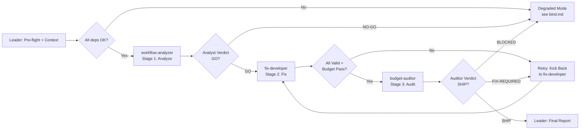

# Workflow: Budgeted Data Fix Pipeline with Independent Audit

## Overview



## Detailed Steps

### Step 0 — Pre-flight

- **Executor**: Leader
- **Input**: [dependencies.yaml](dependencies.yaml)
- **Action**: verify `python3` is available, workspace is accessible, data files exist.
- **Output**: pre-flight report
- **Quality gate**: user decides go/no-go.

### Step 1 — Stage 1: Workflow Analysis

- **Executor**: workflow-analyzer
- **Input**: task spec ({TASK_SPEC}), full workspace
- **Action**: Read all files. Trace main() → fix_file(). Map every defect. Propose minimal-command fix strategy.
- **Output**: Analyst Report matching [roles/workflow-analyzer.md](roles/workflow-analyzer.md)
- **Quality gate**: GO verdict. Max 1 retry.

### Step 2 — Stage 2: Fix Implementation

- **Executor**: fix-developer
- **Input**: analyst's fix strategy ({ANALYST_STRATEGY}), workspace
- **Action**: Delete stale state. Fix all bugs in one pass. Run budgeted_task.py and validate_all.py. Confirm budget ≤28.
- **Output**: Fixed files + Fix Report matching [roles/fix-developer.md](roles/fix-developer.md)
- **Quality gate**: validate_all exit 0, budget_used ≤28. Max 2 retries.

### Step 3 — Stage 3: Budget Audit

- **Executor**: budget-auditor
- **Input**: task spec ({TASK_SPEC}), fixed workspace
- **Action**: Clean-room start. Run workflow independently. Count every command. Verify all files pass validation. Produce attestation.
- **Output**: Audit Report matching [roles/budget-auditor.md](roles/budget-auditor.md)
- **Quality gate**: ALL-PASS attestation. Max 2 kick-back cycles.

### Step 4 — Final: Budgeted Workflow Report

- **Executor**: Leader
- **Input**: all three stage outputs
- **Action**: Compose final report. Surface verbatim. Never mediate.
- **Output**: Budgeted Workflow Report

#### Final Report Format

```markdown
# Budgeted Workflow Fix Report

## Summary
<overview: files fixed, budget used, validation result, attestation result>

## Stage 1: Workflow Analysis
<verbatim>

## Stage 2: Fix Implementation
<verbatim>

## Stage 3: Budget Audit
<verbatim>

## Final Recommendation
- SHIP / NO-SHIP
```

## Acceptance Criteria

- All 3 role outputs match their schemas.
- budgeted_task.py runs; validate_all.py exits 0.
- budget_used ≤28 confirmed independently by auditor.
- output/budget_report.json exists and is valid.
- Auditor attestation: ALL-PASS.
