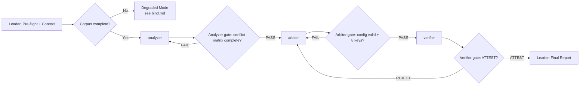

# Workflow: Analyze → Arbitrate → Verify specification conflicts

## Overview



- **Pattern**: C — Specialization Pipeline (3 sequential stages with quality gates).
- **Retry loops**: Analyzer re-dispatched on incomplete matrix; Arbiter re-dispatched on invalid config or wrong key count; pipeline kicks back from Verifier to Arbiter on REJECT.

## Detailed Steps

### Step 0 — Pre-flight: dependency check

- **Executor**: Leader
- **Input**: [dependencies.yaml](dependencies.yaml)
- **Action**: verify each `skills[]` and `tools[]` entry is available. Verify corpus directory exists and contains `requirements.txt` and `priority_rules.txt`.
- **Output**: pre-flight report to user
- **Quality gate**: user decides go/no-go on missing items. Missing required tools = blocker; missing corpus files = halt immediately.

### Step 1 — Conflict Analysis

- **Executor**: `analyzer`
- **Input**: Corpus directory (`requirements.txt`, `priority_rules.txt`), task specification from TASK.md
- **Action**: Read every spec document, catalogue every configuration key with its value and source spec's priority class, build a complete conflict matrix, extract and quote all priority rules and special cases verbatim
- **Output**: Structured conflict analysis matching the `## Output Schema` in [roles/analyzer.md](roles/analyzer.md)
- **Serial / Parallel**: Serial — must complete before Arbiter starts
- **Quality gate**:
  - **Pass criteria**: Conflict matrix covers all 8 configuration keys from the task context, every key is annotated with values from each spec that mentions it, priority rules and the `compression` special case are quoted verbatim, non-conflicting keys are explicitly listed.
  - **Fail action**: Re-dispatch analyzer with explicit instruction to address missing keys or rules. Max 1 retry. On 2nd malformed output, proceed with partial report tagged `[ANALYZER PARTIAL]`.

### Step 2 — Priority Arbitration

- **Executor**: `arbiter`
- **Input**: The Analyzer's conflict analysis (full output from Step 1), workspace path for writing `output/resolved_config.json`
- **Action**: Apply priority rules to every conflict in strict order, handle the `compression` special case, include pass-through keys as-is, produce `output/resolved_config.json` with exactly 8 keys, and a resolution log tracing every decision to its rule
- **Output**: `output/resolved_config.json` in workspace + resolution log matching the `## Output Schema` in [roles/arbiter.md](roles/arbiter.md)
- **Serial / Parallel**: Serial — must complete before Verifier starts
- **Quality gate**:
  - **Pass criteria**: `output/resolved_config.json` exists, parses as valid JSON, contains exactly 8 keys, resolution log accounts for every key with a justification tracing to a specific rule.
  - **Fail action**: Re-dispatch arbiter with the specific failure reason. Max 1 retry. On 2nd failure, mark as `[ARBITER FAILED]` and surface partial output.

### Step 3 — Arbitration Verification

- **Executor**: `verifier`
- **Input**: Corpus directory, `output/resolved_config.json`, task specification
- **Action**: Independently re-read the corpus and priority rules, re-derive every expected value, verify `resolved_config.json` key by key, explicitly audit the `compression` special case, produce ATTEST or REJECT verdict. **Do NOT read the Arbiter's resolution log until after independent verification is complete.**
- **Output**: Verification report matching the `## Output Schema` in [roles/verifier.md](roles/verifier.md)
- **Serial / Parallel**: Serial — final stage before integration
- **Quality gate**:
  - **Pass criteria**: Verdict is ATTEST — all 8 keys independently verified with per-key expected vs actual evidence. Special case audit confirms `compression` handled correctly. Structural check confirms 8 keys, no extras, valid JSON.
  - **Fail action (REJECT)**: Pipeline kicks back to Step 2 (Arbiter) with the Verifier's Violation Details table. The Arbiter fixes the specific violations and re-produces the config. Max 2 kick-back cycles. On 3rd REJECT, surface both reports to user and ask for direction.

### Step 4 — Final: emit Arbitration Report

- **Executor**: Leader
- **Input**: Outputs from all 3 stages — Analyzer conflict matrix, Arbiter resolution log, Verifier attestation report
- **Action**: Compose the final report. If ATTEST: confirm all 8 keys resolved correctly with traceable justifications. If REJECT after max retries: surface unresolved violations verbatim.
- **Output**: Arbitration Report in the format below

#### Final Report Format

```markdown
# Spec Arbitration Report

## Summary
<1-3 sentence overview: verification result, key count, notable resolutions>

## Verification Result
- **Verdict**: ATTEST / REJECT
- **Keys resolved**: 8/8
- **Conflicts resolved**: <N>
- **Pass-through keys**: <N>

## Resolution Summary
| Key | Resolved Value | Source | Rule Applied |
|---|---|---|---|
| backup_interval_hours | 445 | Spec-A | Rule 1: security > freshness |
| compression | <value> | Spec-B | Special case: legacy compat |
| ... | ... | ... | ... |

## Special Case: `compression`
- **Rule**: "<verbatim quote>"
- **Resolution**: <explanation>

## Unresolved Violations (if REJECT)
| Key | Violation | Expected | Actual | Rule Cited |
|---|---|---|---|---|
| ... | ... | ... | ... | ... |

## Coverage Map
- Analyzer: <N conflicts identified, N pass-through keys>
- Arbiter: <N conflicts resolved, N keys in config>
- Verifier: <N keys verified, verdict ATTEST/REJECT>
```

## Acceptance Criteria

- Analyzer produced a conflict matrix covering all 8 configuration keys with priority class annotations and verbatim rule quotes.
- Arbiter produced `output/resolved_config.json` with exactly 8 keys and a resolution log tracing every decision to a specific rule.
- Verifier independently confirmed all 8 keys match the priority rules, including the `compression` special case, or produced a concrete REJECT report with per-key violations.
- Final report contains a binary ATTEST/REJECT verdict with per-key evidence.
- All pipeline gates passed or explicit kick-back/failure recorded.
- No role rewrote upstream output — each stage built on the prior stage's deliverable.
