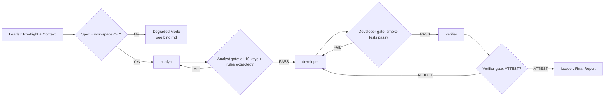

# Workflow: Analyze → Implement → Verify config system

## Overview



- **Pattern**: C — Specialization Pipeline (3 sequential stages with quality gates).
- **Retry loops**: Analyst re-dispatched on incomplete matrix; Developer re-dispatched on test failure; pipeline kicks back from Verifier to Developer on REJECT.

## Detailed Steps

### Step 0 — Pre-flight: dependency check

- **Executor**: Leader
- **Input**: [dependencies.yaml](dependencies.yaml)
- **Action**: verify `python` is available. Verify workspace contains `config_skeleton.py` and `config_schema.json`. Confirm the full specification (TASK.md) is accessible.
- **Output**: pre-flight report to user
- **Quality gate**: user decides go/no-go on missing items. Missing python = blocker. Missing spec = halt immediately.

### Step 1 — Specification Analysis

- **Executor**: `analyst`
- **Input**: Full specification from TASK.md (config schema table, validation rules, type coercion rules, priority cascade, API contract, environment variable mapping)
- **Action**: Extract every requirement into a structured, machine-actionable matrix. Document all 10 config keys with exact types, defaults, validation bounds, coercion rules. Extract priority cascade semantics including edge cases. Document API contract and error handling requirements.
- **Output**: Structured requirements matrix matching the `## Output Schema` in [roles/analyst.md](roles/analyst.md)
- **Serial / Parallel**: Serial — must complete before Developer starts
- **Quality gate**:
  - **Pass criteria**: All 10 config keys documented with type, default, env_var, and exact validation rule. All 5 type coercion categories documented with exact bool input forms. Priority cascade documented with 4 sources and `""` vs `None` override semantics. API contract and error handling requirements extracted.
  - **Fail action**: Re-dispatch analyst with explicit instruction to address missing sections. Max 1 retry. On 2nd malformed output, proceed with partial report tagged `[ANALYST PARTIAL]`.

### Step 2 — Implementation

- **Executor**: `developer`
- **Input**: The Analyst's requirements matrix (full output from Step 1), workspace path, config_skeleton.py for interface reference
- **Action**: Implement `config_system.py` with `ConfigValidationError`, `get_schema()`, `validate_value()`, and `load_config()`. Follow the requirements matrix exactly. Run smoke tests before handoff.
- **Output**: `config_system.py` in workspace + implementation report matching the `## Output Schema` in [roles/developer.md](roles/developer.md)
- **Serial / Parallel**: Serial — must complete before Verifier starts
- **Quality gate**:
  - **Pass criteria**: `config_system.py` exists, imports without error, all 3 smoke tests pass (all-defaults, CLI override, invalid value raises error). Implementation report confirms adherence to all requirements.
  - **Fail action**: Re-dispatch developer with the specific failure reason. Max 1 retry. On 2nd failure, mark as `[DEVELOPER FAILED]` and surface partial output.

### Step 3 — Compliance Verification

- **Executor**: `verifier`
- **Input**: Full specification from TASK.md, `config_system.py` in workspace
- **Action**: Independently design a test suite from the specification. Test every validation boundary, every bool coercion form (all 8 with case variants), every priority cascade combination, and every error path. Run tests against `config_system.py`. **Do NOT read the Developer's implementation report until after independent test design is complete.**
- **Output**: Verification report matching the `## Output Schema` in [roles/verifier.md](roles/verifier.md)
- **Serial / Parallel**: Serial — final stage before integration
- **Quality gate**:
  - **Pass criteria**: Verdict is ATTEST — all tests pass including: 10-key boundary tests, bool coercion exhaustive test (all 8 forms + invalid rejects), priority cascade scenarios (≥4), error path tests (FileNotFoundError, ConfigValidationError message format).
  - **Fail action (REJECT)**: Pipeline kicks back to Step 2 (Developer) with the Verifier's Violation Details table. Max 2 kick-back cycles. On 3rd REJECT, surface both reports to user.

### Step 4 — Final: emit Configuration System Report

- **Executor**: Leader
- **Input**: Outputs from all 3 stages — Analyst requirements matrix, Developer implementation report, Verifier attestation report
- **Action**: Compose the final report with a binary ATTEST/REJECT verdict.
- **Output**: Configuration System Report in the format below

#### Final Report Format

```markdown
# Configuration System Implementation Report

## Summary
<1-3 sentence overview: verification result, keys implemented, key findings>

## Verification Result
- **Verdict**: ATTEST / REJECT
- **Config keys**: 10/10
- **Tests passed**: <N>/<total>
- **Bool coercion forms tested**: 8/8 accepted + <N> rejected

## Key Implementation Details
| Key | Type | Default | Validation | Status |
|---|---|---|---|---|
| host | string | "0.0.0.0" | non-empty | PASS / FAIL |
| port | int | 6155 | [2048, 49151] | PASS / FAIL |
| ... | ... | ... | ... | ... |

## Priority Cascade
- **CLI override**: PASS / FAIL
- **Env var override over file**: PASS / FAIL
- **File override over defaults**: PASS / FAIL
- **"" empty string edge case**: PASS / FAIL

## Unresolved Violations (if REJECT)
| Test ID | Key | Expected | Actual | Rule |
|---|---|---|---|---|
| ... | ... | ... | ... | ... |

## Coverage Map
- Analyst: 10 keys extracted, 5 coercion types, 4-source cascade, API contract
- Developer: 3 functions + exception class implemented, 3 smoke tests
- Verifier: <N> tests designed + executed, verdict ATTEST/REJECT
```

## Acceptance Criteria

- Analyst produced a requirements matrix covering all 10 config keys with exact validation bounds and coercion rules.
- Developer produced `config_system.py` that passes 3 smoke tests and implements the full API contract.
- Verifier independently tested every validation boundary, every bool coercion form, and every priority cascade scenario, producing ATTEST or REJECT with per-test evidence.
- Final report contains a binary ATTEST/REJECT verdict with traceability from spec to test to result.
