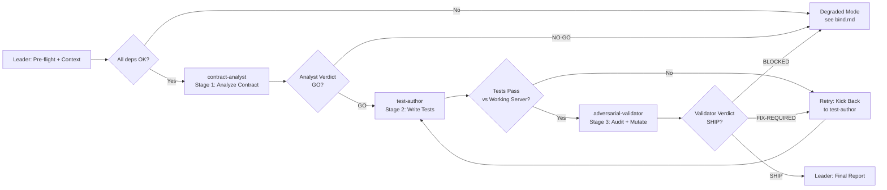

# Workflow: Integration Test Authoring Pipeline with Adversarial Gate

## Overview



## Detailed Steps

### Step 0 — Pre-flight: dependency check

- **Executor**: Leader
- **Input**: [dependencies.yaml](dependencies.yaml)
- **Action**: verify `python3`, `pytest`, `requests`, and `flask` are available. Verify server can start: `python {CODEBASE_PATH}/server.py` runs without import errors.
- **Output**: pre-flight report listing available/missing dependencies
- **Quality gate**: user decides go/no-go on missing items.

### Step 1 — Stage 1: Contract Analysis

- **Executor**: contract-analyst
- **Input**: API contract ({TASK_SPEC}), server code, test skeleton
- **Action**: Read the full API spec and server implementation. Map every endpoint to a complete test-case matrix covering status codes, response schemas, auth, and boundaries. Identify gaps and dependencies.
- **Output**: Analyst Report matching [roles/contract-analyst.md](roles/contract-analyst.md) Output Schema
- **Serial / Parallel**: Serial
- **Quality gate**: Analyst Verdict must be GO (≥9 test functions identified, all 5 endpoints covered, dependency graph complete). Max 1 retry on malformed output.

### Step 2 — Stage 2: Test Authoring

- **Executor**: test-author
- **Input**: Analyst's test-case checklist ({ANALYST_CHECKLIST}), server code, test skeleton
- **Action**: Write complete `tests/test_integration.py` implementing every test case. Follow existing skeleton structure. Run `pytest` against working server. Verify all tests pass.
- **Output**: Complete `tests/test_integration.py` + Test Report matching [roles/test-author.md](roles/test-author.md) Output Schema
- **Serial / Parallel**: Serial
- **Quality gate**: All tests pass against working server (exit 0). Max 2 retries; escalate on 3rd failure.

### Step 3 — Stage 3: Adversarial Validation

- **Executor**: adversarial-validator
- **Input**: Grading criteria ({TASK_SPEC}), test file, working server, broken server
- **Action**: Run tests against working server to confirm they pass. Run against broken server to verify mutation detection. Audit all 12 grading checks. Identify structural weaknesses.
- **Output**: Validation Report matching [roles/adversarial-validator.md](roles/adversarial-validator.md) Output Schema
- **Serial / Parallel**: Serial
- **Quality gate**: Verdict must be SHIP (tests pass working server, ≥1 test fails broken server, all grading checks covered or noted). Max 2 kick-back cycles.

### Step 4 — Final: emit Integration Test Report

- **Executor**: Leader
- **Input**: outputs from all three stages
- **Action**: Compose final report. Surface all stages verbatim. Never mediate contradictions.
- **Output**: Integration Test Report

#### Final Report Format

```markdown
# Search Service Integration Test Report

## Summary
<overview: test count, endpoint coverage, mutation detection result, ship/no-ship>

## Stage 1: Contract Analysis
<Analyst Report verbatim>

## Stage 2: Test Authoring
<Test Report verbatim>

## Stage 3: Adversarial Validation
<Validation Report verbatim>

## Contradictions
- <surfaced verbatim, never mediated>

## Final Recommendation
- SHIP / NO-SHIP with rationale
```

## Acceptance Criteria

- All three roles returned outputs matching their Output Schema.
- Final Report contains all four sections with verbatim role outputs.
- test_integration.py has ≥9 test functions covering all 5 endpoints.
- All tests pass against working server; at least 1 fails against broken server.
- All 12 grading checks audited with clear PASS/MISSING/PARTIAL verdicts.
- Response schema fields verified (not just status codes).
- No hardcoded UUIDs — tests create fresh resources.
- Content-Type header verified in at least 1 test.
