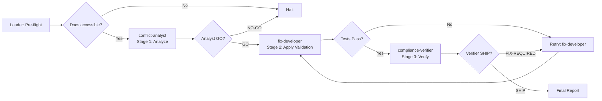

# Workflow: Spec Conflict Arbitration with Independent Compliance Verification

## Overview



## Detailed Steps

### Step 0 — Pre-flight
- **Executor**: Leader
- **Input**: [dependencies.yaml](dependencies.yaml)
- **Action**: verify `python3`, `pytest`, and workspace files exist.
- **Quality gate**: user decides go/no-go.

### Step 1 — Conflict Analysis
- **Executor**: conflict-analyst
- **Input**: api_spec.yaml, CHANGELOG.md, task spec
- **Action**: Read both documents. Map all 7 endpoints. Document spec-vs-changelog conflicts. Categorize: 4 STRICT, 3 RELAXED.
- **Output**: Analyst Report. Quality gate: GO — all 7 endpoints categorized.

### Step 2 — Apply Validation
- **Executor**: fix-developer
- **Input**: analyst's categorization, codebase
- **Action**: Add strict validation to 4 STRICT endpoints. Leave 3 RELAXED untouched. Run pytest.
- **Output**: Fixed code + FIXES_APPLIED.md. Quality gate: tests pass.

### Step 3 — Compliance Verification
- **Executor**: compliance-verifier
- **Input**: categorization, codebase, tests
- **Action**: Test every STRICT endpoint with ≥2 malformed inputs. Test every RELAXED endpoint with relaxed inputs. Run pytest independently.
- **Output**: Verification Report. Quality gate: SHIP.

### Step 4 — Final Report
- **Executor**: Leader
- **Input**: all outputs
- **Action**: Compose. Surface contradictions verbatim.

#### Final Report Format

```markdown
# Spec Conflict Arbitration Report
## Resolution
4 STRICT: ... | 3 RELAXED: ...
## Stage 1: Conflict Analysis (verbatim)
## Stage 2: Validation Applied (verbatim)
## Stage 3: Compliance Verification (verbatim)
## Final Recommendation
SHIP / NO-SHIP
```

## Acceptance Criteria
- All 7 endpoints correctly categorized.
- 4 STRICT endpoints reject malformed inputs with 422.
- 3 RELAXED endpoints accept partner inputs.
- All tests pass.
